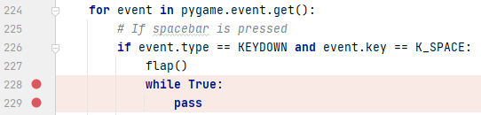
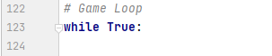

# MERLIN
ModEl-guided Reinforcement LearnINg - an  on-the-fly  game  testing approach for endless runner games. 


Example of model mapping to flappybird case study:
 


## ⚙️ Running the code

```sh
# General format of training commands
python run.py --agent=<merlin, random> --mode=<train>  --game=<flappybird, angrywalls, ...> --exp_name=<foldername to store weights and logs>

# So, for example, to train merlin to play angrywalls:
python run.py --agent=merlin --mode=train --game=angrywalls --exp_name=angrywalls-weights

# General format of evaluation commands for merlin
python run.py --agent=merlin --mode=<eval>  --game=<flappybird, angrywalls, ...> --exp_name=<foldername to load weights and logs> --weights_dir=<folder path inside trained-weights directory eg. angrywalls-v1/4800000.pt> --mutant=<mutantname>

# General format of evaluation commands for random agent
python run.py --agent=random --mode=<eval>  --game=<flappybird, angrywalls, ...> --mutant=<mutantname>


# To test a particular mutant of angrywalls game using merlin agent:
python run.py --agent=merlin --mode=eval --exp_name=angrywalls-v1 --weights_dir=angrywalls-v1/4800000.pt --game=angrywalls --mutant=baseline


# To test a particular mutant of angrywalls game using merlin agent:
python run.py --agent=merlin --mode=eval --exp_name=angrywalls-v1 --weights_dir=angrywalls-v1/4800000.pt --game=angrywalls --mutant=baseline


# To test a particular mutant of angrywalls game using random agent:
python run.py --agent=random --mode=eval --game=angrywalls --mutant=baseline


# To execute the experiment for RQ1 use scripts provided in scripts folder:
#for merlin agent
mutation_testing.sh <game_name> <weights_dir>
# example
mutation_testing flappybird flappybird-wieghts/0200000.pt

#for random agent 
random_mutation_testing.sh <game_name>
# example
random_mutation_testing flappybird 

# To execute the experiment for RQ2 use scripts provided in scripts folder:
#for merlin agent
loc_coverage.sh <game_name> <weights_dir>
# example
loc_coverage flappybird flappybird-wieghts/0200000.pt


# You can also  visualize the training gradient of merlin via TensorBoard
tensorboard --logdir tensorboard-logs/game_name/exp_name
```

For more options, run

```sh
python run.py -h

usage: run.py [-h] [--agent {merlin,random}]
               [--mode {train,evaluation}]
               [--exp_name EXP_NAME] [--weights_dir WEIGHTS_DIR]
               [--n_train_iterations N_TRAIN_ITERATIONS]
               [--learning_rate LEARNING_RATE]
               [--len_agent_history LEN_AGENT_HISTORY]
               [--discount_factor DISCOUNT_FACTOR] [--batch_size BATCH_SIZE]
               [--initial_exploration INITIAL_EXPLORATION]
               [--final_exploration FINAL_EXPLORATION]
               [--final_exploration_frame FINAL_EXPLORATION_FRAME]
               [--replay_memory_size REPLAY_MEMORY_SIZE]
               [--log_frequency LOG_FREQUENCY]
               [--save_frequency SAVE_FREQUENCY] [--n_actions N_ACTIONS]
               [--frame_size FRAME_SIZE]
               [--time_budget HOURS]

experiment options

optional arguments:
  -h, --help            show this help message and exit
  --agent {merlin, random}  agent name merlin or random
  --mode {train,evaluation}
                        run the network in train or evaluation mode
  --exp_name EXP_NAME   name of experiment, to be used as save_dir
  --weights_dir WEIGHTS_DIR
                        name of model to load
  --n_train_iterations N_TRAIN_ITERATIONS
                        number of iterations to train network
  --learning_rate LEARNING_RATE
                        learning rate
  --len_agent_history LEN_AGENT_HISTORY
                        number of stacked frames to send as input to networks
  --discount_factor DISCOUNT_FACTOR
                        discount factor used for discounting return
  --batch_size BATCH_SIZE
                        batch size
  --initial_exploration INITIAL_EXPLORATION
                        epsilon greedy action selection parameter
  --final_exploration FINAL_EXPLORATION
                        epsilon greedy action selection parameter
  --final_exploration_frame FINAL_EXPLORATION_FRAME
                        epsilon greedy action selection parameter
  --replay_memory_size REPLAY_MEMORY_SIZE
                        maximum number of transitions in replay memory
  --log_frequency LOG_FREQUENCY
                        number of batches between each tensorboard log
  --save_frequency SAVE_FREQUENCY
                        number of batches between each model save
  --n_actions N_ACTIONS
                        number of game output actions
  --frame_size FRAME_SIZE
                        size of game frame in pixels
  --time_budget HOURS
                        number of hours to run the random agent  
```

# Parameters specifications for MERLIN agent

MERLIN agent adopts a standard DRL algorithm called Deep Q-learning (DQN) (Mnih et al. 2013). To use the DRL algorithm, we need to define the dimensions for input that we will feed to the neural network that acts as the Q-function and the dimensions of the output layer.  The input dimensions are the visible screen cross-section of the game. The output dimension will be the total number of user actions. This information is extracted from the class diagram. The architecture of the neural network of the DRL agent is shown in figure below and  described as follows.

The input to the neural network consists of 4 consecutive frames of game stacked together. The first hidden layer convolves 32 8 × 8 filters with stride 4 with the input image and applies a rectifier nonlinearity. The second hidden layer convolves 64 4 × 4 filters with stride 2, again followed by a rectifier nonlinearity. The third hidden layer convolves 64 3 × 3 filters with stride 1, again followed by a rectifier nonlinearity. The final hidden layer is fully-connected and consists of 512 rectifier units. The output layer is a fully-connected linear layer with a single output for each valid action described by the user. Other hyperparameters include learning rate α,  discount factor γ, and initial exploration probability e. As default, we use 1e-6, 0.99, and 0.99, respectively. 

The loss function is the mean squared error loss between the predicted and target Q-values. The target Q-values are calculated using the Bellman equation, which considers the immediate reward received from the action taken in the current timestep and the estimated future rewards from subsequent timesteps. The mean squared error loss is then minimized using stochastic gradient descent.


# Mutation operators used in the evaluation of MERLIN

A more in-depth explanation of each mutation operator is available. [Download PDF - Mutation Operators Details](doc/Mutation%20Operators%20in%20MERLIN.pdf)


| Original Code | RUSD Mutant |
| --- | --- |
|  |  |

| Original Code | RUAR Mutant |
| --- | --- |
|  |  |

| Original Code | RUOR Mutant |
| --- | --- |
|  |  |

| Original Code | DCD Mutant |
| --- | --- |
|  |  |

| Original Code | DAL Mutant |
| --- | --- |
|  | |

| Original Code | ARR Mutant |
| --- | --- |
|  |  |

| Original Code | ADD Mutant |
| --- | --- |
|  |  |

| Original Code | AVI Mutant |
| --- | --- |
|  |  |

| Original Code | AVD Mutant |
| --- | --- |
|  |  |

| Original Code | GFA Mutant |
| --- | --- |
|  | |

| Original Code | GFT Mutant |
| --- | --- |
|  |  |

| Original Code | GFS Mutant |
| --- | --- |
|  |  |

**Figure: Examples of mutation operators.**

